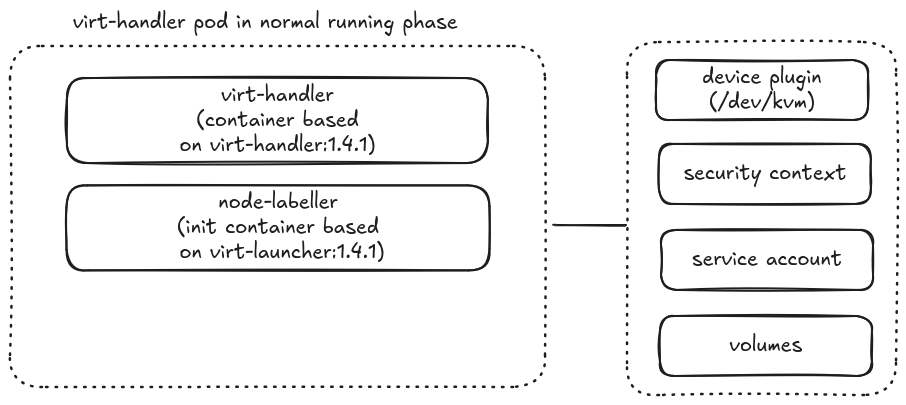
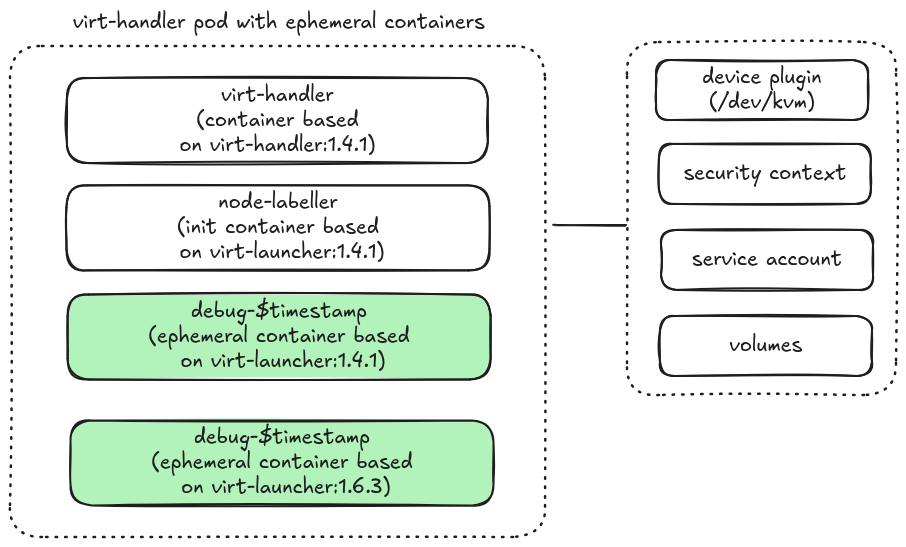

# CPU Capabilities Discovery Tool

The `cpu_caps` tool discovers and collects the host CPU capabilities
information from all the KubeVirt `virt-handler` DaemonSet pods in the
`${KUBEVIRT_NAMESPACE}` namespace.

It allows us to compare the CPU capabilities information identified by different
versions of `virt-handler` and also identify any global CPU model candidates. A
CPU model is considered a globally supported candidate if all of the
nodes support it.

## Prerequisites

[KubeVirt](https://kubevirt.io/) must be running on the cluster.

The kubeconfig must be included in the shell `$PATH` with permissions to run
`kubectl [debug|cp|exec]` targeting the `${KUBEVIRT_NAMESPACE}` namespace.

## Usage

```sh
$ cpu_caps -h
A rust application to detect kubevirt virtual machine cpu capabilities as reported by libvirt

Usage: cpu_caps [OPTIONS]

Options:
  -k, --kubevirt-ns <KUBEVIRT_NS>
          Namespace where kubevirt is installed [default: kubevirt]
  -s, --selector <SELECTOR>
          Label selector to find virt-handler pods [default: kubevirt.io=virt-handler]
  -d, --debugger-image <DEBUGGER_IMAGE>
          Optional virt-launcher image to use for collecting libvirt data. If not provided, the tool attempts to use quay.io/kubevirt/virt-launcher based on the kubevirt version in the cluster
  -t, --debugger-ttl-seconds <DEBUGGER_TTL_SECONDS>
          Time to live for the debugger pod in seconds. After this duration, the pod will be automatically deleted. Default is 3600 seconds (1 hour) [default: 3600]
  -h, --help
          Print help
  -V, --version
          Print version
```

## Quick Start

For testing purposes, create a 3-node [Kind][0] cluster:

```sh
make kind
```

To generate the CPU capabilities report using the default `virt-launcher` image:

```sh
cpu_caps
```

```yaml
global_caps:
- Westmere
- Dhyana-v1
- IvyBridge-IBRS
- EPYC-Rome-v4
- IvyBridge-v1
- Nehalem-v1
- Nehalem-v2
- Nehalem
- SandyBridge-v1
- Westmere-IBRS
- Westmere-v1
- Denverton-v3
- EPYC-IBPB
- Nehalem-IBRS
- SandyBridge
- EPYC-v4
- Opteron_G3-v1
- Dhyana-v2
- Penryn
- Westmere-v2
- EPYC-Rome-v3
- Dhyana
- EPYC-v1
- EPYC-Rome
- EPYC
- Denverton-v2
- EPYC-Rome-v2
- Opteron_G3
- EPYC-Rome-v1
- EPYC-v3
- IvyBridge-v2
- EPYC-v2
- IvyBridge
- SandyBridge-v2
- Penryn-v1
- SandyBridge-IBRS
nodes_caps:
- node_name: dev-worker
  host_cpu_model:
    name: EPYC-Genoa
    vendor: AMD
    required_features:
    - x2apic
    - tsc-deadline
    - hypervisor
    - tsc_adjust
    - spec-ctrl
    - stibp
    - flush-l1d
    - ssbd
    - cmp_legacy
    - overflow-recov
    - succor
    - invtsc
    - virt-ssbd
    - lbrv
    - tsc-scale
    - vmcb-clean
    - flushbyasid
    - pause-filter
    - pfthreshold
    - vgif
    - sbpb
    - ibpb-brtype
    - perfmon-v2
  supported_features:
  - 3dnowprefetch
  - abm
  - adx
  - aes
  - amd-psfd
  - amd-ssbd
  - amd-stibp
  - apic
  - arat
  - auto-ibrs
  - avx
  - avx2
  - avx512-bf16
  - avx512-vpopcntdq
  - avx512bitalg
  - avx512bw
  - avx512cd
  - avx512dq
  - avx512f
  - avx512ifma
  - avx512vbmi
  - avx512vbmi2
  - avx512vl
  - avx512vnni
  - bmi1
  - bmi2
  - clflush
  - clflushopt
  - clwb
  - clzero
  - cmov
  - cmp_legacy
  - cr8legacy
  - cx16
  - cx8
  - de
  - erms
  - f16c
  - flush-l1d
  - flushbyasid
  - fma
  - fpu
  - fsgsbase
  - fsrm
  - fxsr
  - fxsr_opt
  - gfni
  - hypervisor
  - ibpb
  - ibpb-brtype
  - ibrs
  - invpcid
  - invtsc
  - lahf_lm
  - lbrv
  - lfence-always-serializing
  - lm
  - mca
  - mce
  - misalignsse
  - mmx
  - mmxext
  - movbe
  - msr
  - mtrr
  - no-nested-data-bp
  - npt
  - nrip-save
  - null-sel-clr-base
  - nx
  - osvw
  - overflow-recov
  - pae
  - pat
  - pause-filter
  - pclmuldq
  - pdpe1gb
  - perfctr_core
  - perfmon-v2
  - pfthreshold
  - pge
  - pku
  - pni
  - popcnt
  - pse
  - pse36
  - rdpid
  - rdrand
  - rdseed
  - rdtscp
  - sbpb
  - sep
  - sha-ni
  - smap
  - smep
  - spec-ctrl
  - ssbd
  - sse
  - sse2
  - sse4.1
  - sse4.2
  - sse4a
  - ssse3
  - stibp
  - stibp-always-on
  - succor
  - svm
  - svme-addr-chk
  - syscall
  - tsc
  - tsc-deadline
  - tsc-scale
  - tsc_adjust
  - umip
  - vaes
  - vgif
  - virt-ssbd
  - vmcb-clean
  - vme
  - vnmi
  - vpclmulqdq
  - wbnoinvd
  - x2apic
  - xgetbv1
  - xsave
  - xsavec
  - xsaveerptr
  - xsaveopt
  - xsaves
  supported_models:
  - Denverton-v2
  - Denverton-v3
  - Dhyana
  - Dhyana-v1
  - Dhyana-v2
  - EPYC
  - EPYC-IBPB
  - EPYC-Rome
  - EPYC-Rome-v1
  - EPYC-Rome-v2
  - EPYC-Rome-v3
  - EPYC-Rome-v4
  - EPYC-v1
  - EPYC-v2
  - EPYC-v3
  - EPYC-v4
  - IvyBridge
  - IvyBridge-IBRS
  - IvyBridge-v1
  - IvyBridge-v2
  - Nehalem
  - Nehalem-IBRS
  - Nehalem-v1
  - Nehalem-v2
  - Opteron_G3
  - Opteron_G3-v1
  - Penryn
  - Penryn-v1
  - SandyBridge
  - SandyBridge-IBRS
  - SandyBridge-v1
  - SandyBridge-v2
  - Westmere
  - Westmere-IBRS
  - Westmere-v1
  - Westmere-v2
  virsh_version: |-
    Compiled against library: libvirt 11.9.0
    Using library: libvirt 11.9.0
    Using API: QEMU 11.9.0
    Running hypervisor: QEMU 10.1.0
  virt_launcher_image: quay.io/kubevirt/virt-launcher:v1.8.1
- node_name: dev-worker2
  host_cpu_model:
    name: EPYC-Genoa
    vendor: AMD
    required_features:
    - x2apic
    - tsc-deadline
    - hypervisor
    - tsc_adjust
    - spec-ctrl
    - stibp
    - flush-l1d
    - ssbd
    - cmp_legacy
    - overflow-recov
    - succor
    - invtsc
    - virt-ssbd
    - lbrv
    - tsc-scale
    - vmcb-clean
    - flushbyasid
    - pause-filter
    - pfthreshold
    - vgif
    - sbpb
    - ibpb-brtype
    - perfmon-v2
  supported_features:
  - 3dnowprefetch
  - abm
  - adx
  - aes
  - amd-psfd
  - amd-ssbd
  - amd-stibp
  - apic
  - arat
  - auto-ibrs
  - avx
  - avx2
  - avx512-bf16
  - avx512-vpopcntdq
  - avx512bitalg
  - avx512bw
  - avx512cd
  - avx512dq
  - avx512f
  - avx512ifma
  - avx512vbmi
  - avx512vbmi2
  - avx512vl
  - avx512vnni
  - bmi1
  - bmi2
  - clflush
  - clflushopt
  - clwb
  - clzero
  - cmov
  - cmp_legacy
  - cr8legacy
  - cx16
  - cx8
  - de
  - erms
  - f16c
  - flush-l1d
  - flushbyasid
  - fma
  - fpu
  - fsgsbase
  - fsrm
  - fxsr
  - fxsr_opt
  - gfni
  - hypervisor
  - ibpb
  - ibpb-brtype
  - ibrs
  - invpcid
  - invtsc
  - lahf_lm
  - lbrv
  - lfence-always-serializing
  - lm
  - mca
  - mce
  - misalignsse
  - mmx
  - mmxext
  - movbe
  - msr
  - mtrr
  - no-nested-data-bp
  - npt
  - nrip-save
  - null-sel-clr-base
  - nx
  - osvw
  - overflow-recov
  - pae
  - pat
  - pause-filter
  - pclmuldq
  - pdpe1gb
  - perfctr_core
  - perfmon-v2
  - pfthreshold
  - pge
  - pku
  - pni
  - popcnt
  - pse
  - pse36
  - rdpid
  - rdrand
  - rdseed
  - rdtscp
  - sbpb
  - sep
  - sha-ni
  - smap
  - smep
  - spec-ctrl
  - ssbd
  - sse
  - sse2
  - sse4.1
  - sse4.2
  - sse4a
  - ssse3
  - stibp
  - stibp-always-on
  - succor
  - svm
  - svme-addr-chk
  - syscall
  - tsc
  - tsc-deadline
  - tsc-scale
  - tsc_adjust
  - umip
  - vaes
  - vgif
  - virt-ssbd
  - vmcb-clean
  - vme
  - vnmi
  - vpclmulqdq
  - wbnoinvd
  - x2apic
  - xgetbv1
  - xsave
  - xsavec
  - xsaveerptr
  - xsaveopt
  - xsaves
  supported_models:
  - Denverton-v2
  - Denverton-v3
  - Dhyana
  - Dhyana-v1
  - Dhyana-v2
  - EPYC
  - EPYC-IBPB
  - EPYC-Rome
  - EPYC-Rome-v1
  - EPYC-Rome-v2
  - EPYC-Rome-v3
  - EPYC-Rome-v4
  - EPYC-v1
  - EPYC-v2
  - EPYC-v3
  - EPYC-v4
  - IvyBridge
  - IvyBridge-IBRS
  - IvyBridge-v1
  - IvyBridge-v2
  - Nehalem
  - Nehalem-IBRS
  - Nehalem-v1
  - Nehalem-v2
  - Opteron_G3
  - Opteron_G3-v1
  - Penryn
  - Penryn-v1
  - SandyBridge
  - SandyBridge-IBRS
  - SandyBridge-v1
  - SandyBridge-v2
  - Westmere
  - Westmere-IBRS
  - Westmere-v1
  - Westmere-v2
  virsh_version: |-
    Compiled against library: libvirt 11.9.0
    Using library: libvirt 11.9.0
    Using API: QEMU 11.9.0
    Running hypervisor: QEMU 10.1.0
  virt_launcher_image: quay.io/kubevirt/virt-launcher:v1.8.1
```

`cpu_caps` generates the CPU capabilities report in YAML format with their
following structure:

* `global_caps` lists the globally supported CPU models across all nodes
* `node_caps` lists the CPU capabilities information for each node, including
the host CPU model, supported CPU models and features, libvirt and qemu versions,
and the `virt-launcher` image used to collect the information.

The YAML output can be redirected to a file for further analysis using tools like
`yq`.

The following is a list of useful `yq` queries:

```sh
# show the host cpu model information on node dev-worker
yq '.nodes_caps[] | select(.node_name=="dev-worker")' report.yaml

# show the supported cpu models on node dev-worker2
yq '.nodes_caps[] | select(.node_name=="dev-worker2")' report.yaml

# show the libvirt and qemu versions of all nodes
yq '.nodes_caps[] | pick(["node_name", "virsh_version"])' report.yaml
```

To check the CPU capabilities information generated by the older 1.6.3 version of
`virt-launcher`:

```sh
cpu_caps -d quay.io/kubevirt/virt-launcher:1.6.3
```

## How It Works

The script starts an ephemeral `virt-launcher` container in each `virt-handler`
pod to collect the host CPU capabilities information of the node. Essentially, it
replicates the task performed by the KubeVirt `node-labeller` init container in
real time, without launching a new pod.

If the optional `-d` argument is specified, the script uses its value as the
image of the ephemeral container. This allows us to compare the information
generated by different versions of `virt-launcher`, libvirt and QEMU.

Without the `-d` argument, the ephemeral container uses the same image as the
`virt-handler` container.

The container executes the KubeVirt `node-labeller.sh` script<sup>[ref][6]</sup>, writes
the output XML files to the container's `/var/lib/kubevirt-node-labeller` folder,
and copies the output from the container to your shell. It operates within the
security context boundary of its owner `virt-handler` pod.

[6]: https://github.com/kubevirt/kubevirt/blob/de16a73f4ea3e48a5c8796d9db508b49960417bb/cmd/virt-launcher/node-labeller/node-labeller.sh




To check the state of the ephemeral containers in all the `virt-handler` pods:

```sh
kubectl -n kubevirt get po -lkubevirt.io=virt-handler -ojsonpath='{.items[*].status.ephemeralContainerStatuses}' | jq -r '.[] | select(.name | test("debugger-")) | "Name: \(.name), State: \(.state)"'
```

```sh
Name: debugger-1775708476, State: {"running":{"startedAt":"2026-04-09T04:21:16Z"}}
Name: debugger-1775708481, State: {"running":{"startedAt":"2026-04-09T04:21:21Z"}}
Name: debugger-1775708503, State: {"running":{"startedAt":"2026-04-09T04:21:43Z"}}
Name: debugger-1775708963, State: {"running":{"startedAt":"2026-04-09T04:29:23Z"}}
```

To view their logs:

```sh
kubectl -n kubevirt logs virt-handler-t2qlz -c debugger-1775708476
```

```sh
+ mkdir -p /var/lib/kubevirt-node-labeller
+ node-labeller.sh
+ KVM_HYPERVISOR_DEVICE=kvm
+ KVM_VIRTTYPE=kvm
+ '[' -z '' ']'
+ echo 'Warning: Env vars HYPERVISOR_DEVICE or PREFERRED_VIRTTYPE not set. Defaulting to KVM values for both vars'
+ echo 'Currently specified values: HYPERVISOR_DEVICE='\'''\'', PREFERRED_VIRTTYPE='\'''\'''
Warning: Env vars HYPERVISOR_DEVICE or PREFERRED_VIRTTYPE not set. Defaulting to KVM values for both vars
Currently specified values: HYPERVISOR_DEVICE='', PREFERRED_VIRTTYPE=''
+ HYPERVISOR_DEVICE=kvm
+ PREFERRED_VIRTTYPE=kvm
++ uname -m
+ ARCH=x86_64
+ MACHINE=q35
+ '[' x86_64 == aarch64 ']'
+ '[' x86_64 == s390x ']'
+ '[' x86_64 '!=' x86_64 ']'
+ set +o pipefail
+ HYPERVISOR_DEV_PATH=/dev/kvm
++ grep -w kvm /proc/misc
++ cut -f 1 '-d '
+ HYPERVISOR_DEV_MINOR=232
+ set -o pipefail
+ VIRTTYPE=qemu
+ '[' '!' -e /dev/kvm ']'
+ '[' -e /dev/kvm ']'
+ chmod o+rw /dev/kvm
+ VIRTTYPE=kvm
+ '[' -e /dev/sev ']'
+ virtqemud -d
+ virsh domcapabilities --machine q35 --arch x86_64 --virttype kvm
+ '[' x86_64 == x86_64 ']'
+ virsh domcapabilities --machine q35 --arch x86_64 --virttype kvm
+ virsh hypervisor-cpu-baseline --features /dev/stdin --machine q35 --arch x86_64 --virttype kvm
+ virsh capabilities
+ virsh version
+ touch /var/lib/kubevirt-node-labeller/.done
+ sleep 3600
```

The ephemeral container has a default TTL of 1 hour. It does not interfere with
the operation of the primary container and is automatically removed when the
owner pod is restarted.

### CPU Capabilities And KubeVirt Node Labeling

This section provides a brief description on the mapping between the reported CPU
capabilities and the node labels managed by the KubeVirt `node-labeller` controller.

The supported CPU models (aka. named models) are gathered from the
`virsh_domcapabilities.xml` file by parsing the non-`host-model` modes for
`usable` models. This is the list of CPU models where all their features are
supported by the node, according to `libvirt`. After removing the obsolete CPU
models from this list, the KubeVirt `node-labeller` controller uses the list to
generate the `cpu-model.node.kubevirt.io` labels on the nodes<sup>[ref][3]</sup>.

The CPU host model name, vendor and required features are parsed from the
`host-model` mode section in the `virsh_domcapabilities.xml` file. Features
identified with the `require` policy are deemed as required by the host CPU model.
According to `libvirt`, this model is the closest match to the host CPU from the
list of supported models. They are translated to the
`host-model-cpu.node.kubevirt.io`, `cpu-vendor.node.kubevirt.io` and
`host-model-required-features.node.kubevirt.io` labels on the nodes<sup>[ref][2]</sup>.

During live migration, KubeVirt updates the `virt-launcher` pods of virtual
machines that don't have specific CPU model and features defined, with the host
CPU model and its required features as the pod's node selectors.

In contrast, virtual machines that have specific CPU model defined in its
specification ends up with `virt-launcher` pod that uses the named model as its
node selector.

It is possible for a CPU model to appear in the `host-model-cpu.node.kubevirt.io`
label, but not in the `cpu-model.node.kubevirt.io` label because the node may not
support all the required features of that model<sup>[ref][5]</sup>.

The known CPU models are the superset of the supported CPU models, which include
non-`usable` models. Obsolete CPU models are excluded from this list to form the
list of CPUs in the `cpu-model-migration.node.kubevirt.io` labels on the
nodes<sup>[ref][4]</sup>. These labels indicate that a node is a potential
migration target for virtual machines using the specified host CPU model only if
all the features required by the host model are supported on the node.

The supported features are gathered from the `supported_features.xml` files.
These are features marked with the `require` policy. They are translated to the
`cpu-feature.node.kubevirt.io` label<sup>[ref][1]</sup></sup>.

[1]: https://github.com/kubevirt/kubevirt/blob/de16a73f4ea3e48a5c8796d9db508b49960417bb/pkg/virt-handler/node-labeller/node_labeller.go#L241-L245
[2]: https://github.com/kubevirt/kubevirt/blob/de16a73f4ea3e48a5c8796d9db508b49960417bb/pkg/virt-handler/node-labeller/node_labeller.go#L279-L284
[3]: https://github.com/kubevirt/kubevirt/blob/de16a73f4ea3e48a5c8796d9db508b49960417bb/pkg/virt-handler/node-labeller/node_labeller.go#L248-L250
[4]: https://github.com/kubevirt/kubevirt/blob/de16a73f4ea3e48a5c8796d9db508b49960417bb/pkg/virt-handler/node-labeller/node_labeller.go#L251-L253
[5]: https://github.com/kubevirt/kubevirt/issues/14813

## Development

To build and test the code:

```sh
make check

make run

make test
```

To re-generate the Rust structs in the `src/de/types` module:

```sh
make xml_to_rs
```

## LICENSE

Apache License Version 2.0.

See [LICENSE](LICENSE).

[0]: https://kind.sigs.k8s.io/
